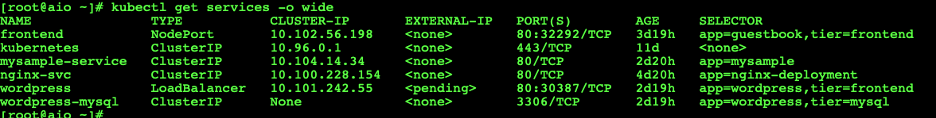
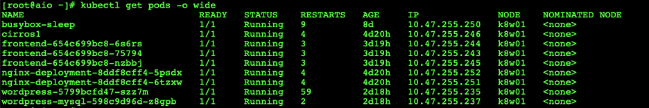
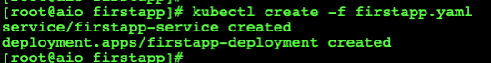
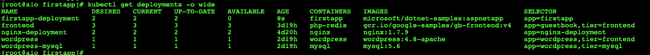
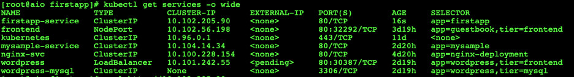
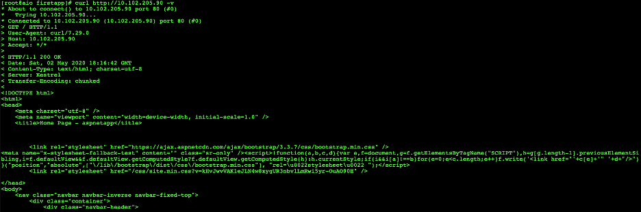
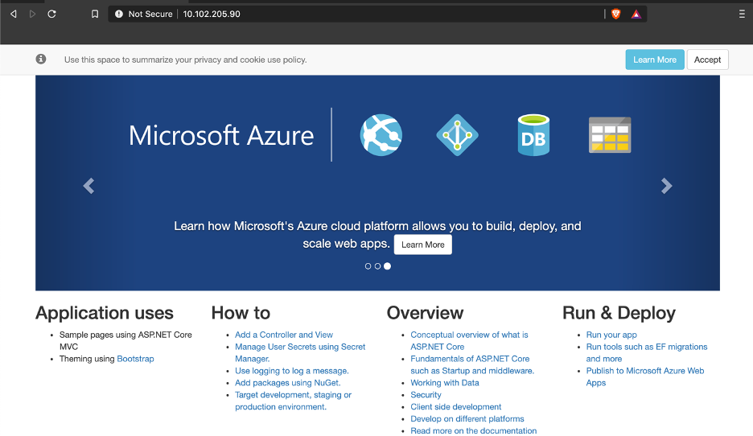

# My First Kubernetes Application

Assuming that we have a fully functional K8 cluster running and accessible from the GUI, this is now time to build our first two tier application orchestrated through kubernetes. 

My cluster is built leveraing Contrail as a CNI, one can read more about Contrail as a CNI for multiple node Kubernestes cluster.
This [link](https://kubernetes.io/docs/concepts/cluster-administration/networking/#contrail--tungsten-fabric) has more information.

I do have a seperate git link as to how one can access the dashboard, follow this [link](https://github.com/sasfar/kubernetes-Dashboard)

When you deploy your app as a “Pod” it gets a random local IP each time from a 10.32/12 pool, that is only accessible from inside your cluster. Then you create a “Service” to allow other Containers/Pods to access your service by name (not knowing it’s IP). This only works for services that needs to be internally accessible, like APIs that are going to be accessed from front-ends. But what about front-ends themselves that needs to be accessed by users from outside the cluster?

This is where Ingress allows (external traffic to go inside the cluster, routing it to the correct service internally). So you can deploy as many apps as you want inside the cluster (but say only one process can gain access to the port 80 on the physical machine/cluster node). So you deploy an ingress Pod in this basic example, it’s an NGINX web server, that listen to the actual physical port 80 on the cluster nodes, and then configure it to route traffic the rest of apps

---
If you would like to skip reading and like watching this in video, follow the below link for a vide demo [My First K8 Application ](https://youtu.be/SzT4l1PPV8Q)

---

## My First k8 Application

In this lab, I will deploy an application on the k8 environment that I created in the last setup. For starters, I’ll use the sample asp.net core website that doesn’t need a database. 

Let's start with the service and deployments manifests mentioned below.

~~~
root@aio firstapp]# more firstapp.yaml 
kind: Service
apiVersion: v1
metadata:
  name: firstapp-service
spec:
  selector:
    app: firstapp
  ports:
  - protocol: TCP
    port: 80
    targetPort: 80
---
apiVersion: apps/v1
kind: Deployment
metadata:
  name: firstapp-deployment
  labels:
    app: firstapp
spec:
  replicas: 2
  selector:
    matchLabels:
      app: firstapp
  template:
    metadata:
      labels:
        app: firstapp
    spec:
      containers:
      - name: firstapp
        image: microsoft/dotnet-samples:aspnetapp
        ports:
        - containerPort: 80
~~~

This file describes 2 Kubernetes objects:
* *Service*: with the name firstapp-service that direct traffic to this service to any Pod with label firstapp. It’s recommended that you define services before Pods.

* *Deployment*: with a name and label (it’s good to use a lot of labels for your objects to be able to select them later). And it defines that we need a replica set with 2 instances of this Pod template, and define that we need to match Pods with our label. Then define the template which has a spec saying the required container image (here is an image from Docker Hub), and we define that we expose port 80.

Here, I am creating a deployment name firstapp-deployment and a service to expose the application to the internet name first-appservice. 

Once the deployments and the pods are setup, I can curl on the service externally from the internet. Here is how I ran the first application, let’s check the current deployment, and services in the k8 cluster.

the current status of the services

and the current status of the pods in the environment

Let's run the manifests.

let's examine the new services and deployments created.

at this moment, we should be able to curl on this service from the local machine.

### Note that the service is currently only available from inside the cluster network, which means we will not be able to browse it directly and will have to use the proxy to test it or we can curl it from the localhost.

#### You have deployed your first app to Kubernetes!